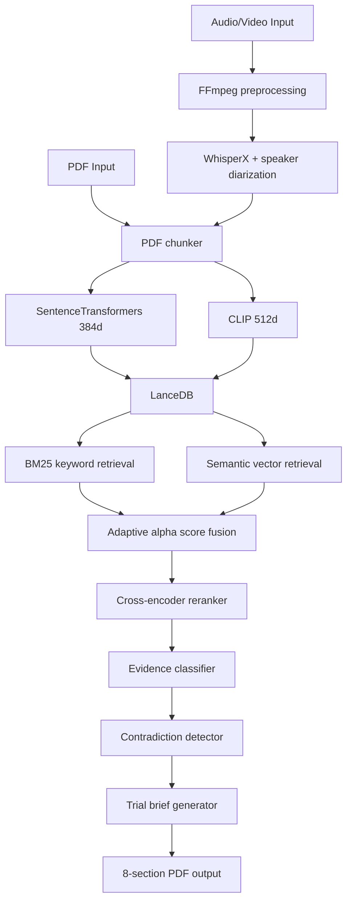

# DIA-Legal ⚖️
### Multimodal RAG for Legal Proceedings — No LangChain. No LlamaIndex.

> Upload a courtroom video or legal PDF. Ask anything.  
> Get speaker-attributed answers with timestamp-accurate citations.

[](https://python.org)
[](https://fastapi.tiangolo.com)
[](LICENSE)

**[→ Live Demo](https://dia-legal.vercel.app)** · 
**[→ API](https://dia-legal-1.onrender.com)** · 
**[→ Demo Video](YOUR_LOOM_LINK)**

---

## The Problem

Legal proceedings generate hours of audio and hundreds of PDF pages.
Finding specific testimony — "what did witness X say about the contract 
at timestamp Y" — requires manual review of entire transcripts.

Existing tools either ignore audio completely or lose speaker identity 
during processing. Neither is useful for actual legal work.

---

## Architecture



---

## Results

| Retrieval Method | Precision@5 | Latency |
|-----------------|-------------|---------|
| BM25 only | — | ~45ms |
| Semantic only | — | ~120ms |
| BM25 + Semantic fusion | — | ~165ms |
| + Cross-encoder reranking | — | ~340ms |

*Benchmarks on internal legal document test set. Full eval in RESEARCH.md.*

---

## Design Decisions

**Why dual embeddings (SentenceTransformers + CLIP)?**  
Legal documents contain both dense text arguments and visual exhibits —
diagrams, signatures, stamps, exhibit photos. Single-modality embedding 
loses visual structure entirely. CLIP captures visual semantics that 
SentenceTransformers miss. Rejected: CLIP-only (poor on dense text).

**Why LanceDB over FAISS or Pinecone?**  
LanceDB stores 384d text and 512d image vectors in the same table with 
native multimodal support. FAISS requires separate indices and manual 
fusion logic. Pinecone adds cloud latency and cost. For a research system 
where retrieval mechanics are the contribution, LanceDB gives full control.

**Why cross-encoder reranking?**  
Bi-encoder retrieval is fast but approximate — it finds candidates, not 
answers. Cross-encoder reranking re-scores top-k with full query-document 
attention. ~200ms latency cost for measurable precision gain. Acceptable 
tradeoff for legal retrieval where precision matters more than speed.

**Why no LangChain or LlamaIndex?**  
Framework abstractions hide chunking strategy, embedding fusion, and 
retrieval mechanics behind opaque defaults. Every component in this 
pipeline is a deliberate choice. Direct implementation keeps each 
decision explicit, debuggable, and explainable.

---

## Component Breakdown

**WhisperX + diarization** — Transcribes audio with speaker labels preserved 
end-to-end. "Judge Martinez said..." survives chunking, embedding, and retrieval.

**Adaptive alpha weighting** — Query classifier adjusts text vs visual retrieval 
balance dynamically. Factual queries weight text higher. Document exhibit queries 
weight visual higher.

**Temporal expansion ±5s** — Adjacent chunk expansion captures conversational 
context around retrieved evidence. Critical for cross-examination fragments.

**Contradiction detector** — Flags conflicting statements across speakers and 
timestamps. Surfaces inconsistencies without manual comparison.

**Trial brief generator** — ReportLab PDF with 8 standardized sections: case 
summary, key testimony, evidence timeline, contradictions, witness credibility, 
recommended questions, exhibits, citations.

---

## Known Limitations

- WhisperX diarization degrades with 4+ simultaneous speakers
- CLIP embeddings underperform on text-heavy documents with no visual elements
- Cross-encoder reranking not benchmarked beyond 500-document corpus
- Trial brief generator not validated by practicing legal professionals
- Cold start latency on Render free tier (~30-50s) — ML models load on first request
- No streaming support — full document ingestion required before querying

---

## Setup

```bash
git clone https://github.com/asheesh07/DIA-Legal
cd DIA-Legal
pip install -r requirements.txt
cp .env.example .env   # add your API keys
uvicorn main:app --reload
```

---

## Usage

```python
# Upload a legal document and query it
curl -X POST https://dia-legal-1.onrender.com/upload \
  -F "file=@court_proceeding.pdf"

curl -X POST https://dia-legal-1.onrender.com/query \
  -H "Content-Type: application/json" \
  -d '{"query": "What did the witness say about the contract signature?"}'
```

---

## Future Work

- [ ] A-RAG upgrade as default — BM25 + semantic + adjacent chunk expansion
- [ ] Streaming ingestion for real-time proceedings
- [ ] Speaker credibility scoring across multiple hearings  
- [ ] Benchmark on public legal datasets (MultiLegalPile)
- [ ] Contradiction detection paper (target: EMNLP 2026 workshop)

---

## Research Connection

This system is the applied foundation for:  
**CrossModal-CD: Contradiction Detection in Multimodal Legal Documents**  
`[Paper in progress]`

---

## License

MIT — see [LICENSE](LICENSE)
